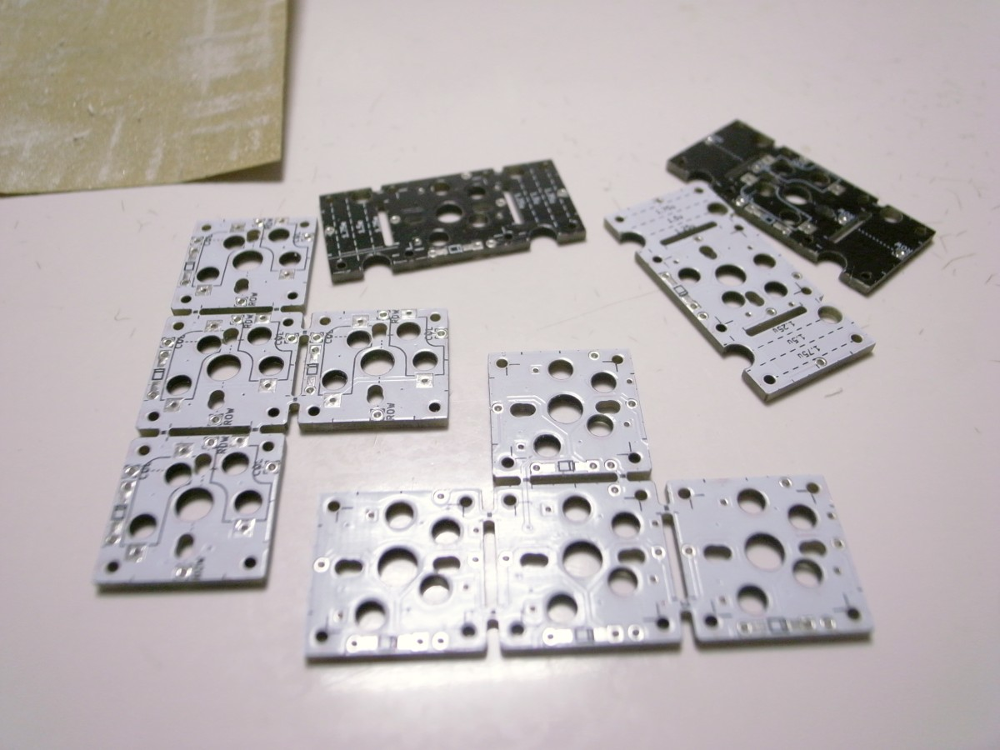
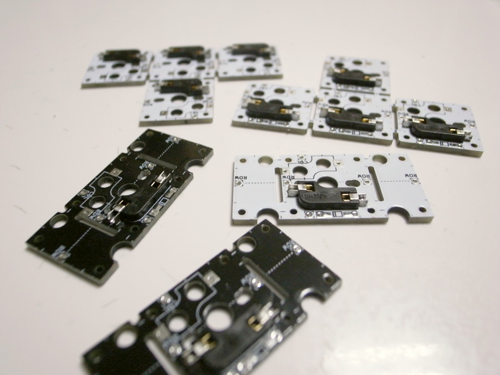
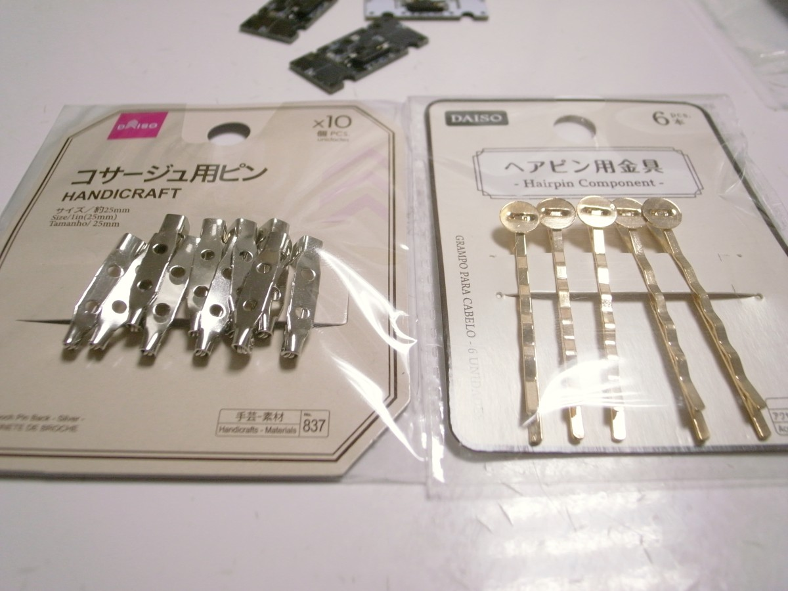
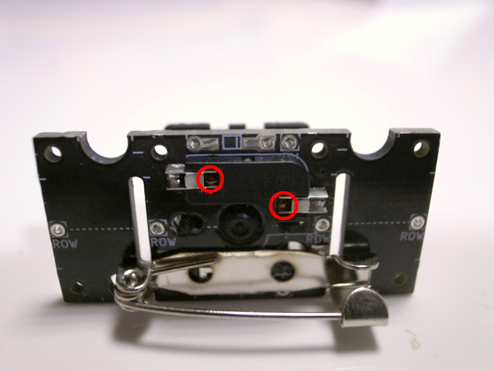

# Badge and Clip

## 必要なパーツ
| 名前 | 数 | 備考 | 調達先の例 | 参考価格（送料込） |
|:-|:-|:-|--|--|
| SU120 PCB | 1枚 | [入手方法はこちら](../common/pcb_order_guide_jp.md) | [Elecrow Online Store](https://www.elecrow.com/pcb-manufacturing.html) | 10枚で1,400円($12.94) |
| Kailh PCBソケット CherryMX用 または Choc用 | 数個 | | https://talpkeyboard.stores.jp/items/5e02c5405b120c792616bcf9 | 10個で150円+送料330円 |
| 5ピン仕様のキースイッチ CherryMX用 または Choc用 | 数個 |  | https://talpkeyboard.stores.jp/?category_id=59cf8860ed05e668db003f5d | 10個で450円～ |
| キーキャップ CherryMX用 または Choc用 | 15個 |  | CherryMX用 https://talpkeyboard.stores.jp/?category_id=59e2acfaed05e644fd004008 | 1個で110円～ |
| コサージュ用ピン または ヘアピン用金具 |  |  | ダイソー | 110円 |
| ゼリー状瞬間接着剤 | 1本 |  | ダイソー | 110円 |
| 計 |  |  |  | 2,660円 |

## 使用する道具、消耗品

[使用する道具、消耗品](../common/tool_guide_jp.md)を参照ください。

## ビルドガイド

### 基板のカット

ほしい形状になるようにニッパーで切っていきます。切る前にピンや金具を付ける位置を考えておくとよいです。

ニッパーで表裏に切れ目を入れてから手で折り割ってください。

### 基板側面のヤスリがけ

机に紙ヤスリを置き、その上で基板のバリがある側面をヤスリがけします。粗目だけでも結構きれいになります。お好みで細目までかけてもよいです。

### PCBソケットの取り付け

基板の裏の印刷された枠に合うようにPCBソケットを配置します。
CherryMX用のPCBソケットを置く場合は、間違った向きに置かないように注意してください。間違った向きに取り付けるとあとでキースイッチが入りません。

PCBソケット両端の金属部分をハンダ付けします。

### ピン、金具の取り付け

ピンまたは金具を置いてみて、PCBソケット、キースイッチに干渉しない場所を探してください。位置が決まったらゼリー状瞬間接着剤で接着し、硬化するまで待ちます。

2液混合タイプのアクリル接着剤では力を入れると外れてしまったので、瞬間接着剤がおすすめです。白化した場合は無水エタノールで拭くと若干きれいになります。

### キースイッチの取り付け

表側から差し込みます。キースイッチの足が曲がっている場合はまっすぐにしてから差し込んでください。

髪留めなど、キースイッチが外れることが懸念される場合は、図の赤丸の部分をはんだ付けし、キースイッチを外れないようにしてください。

### キーキャップの取り付け

キースイッチにキーキャップをはめたら完成です。

