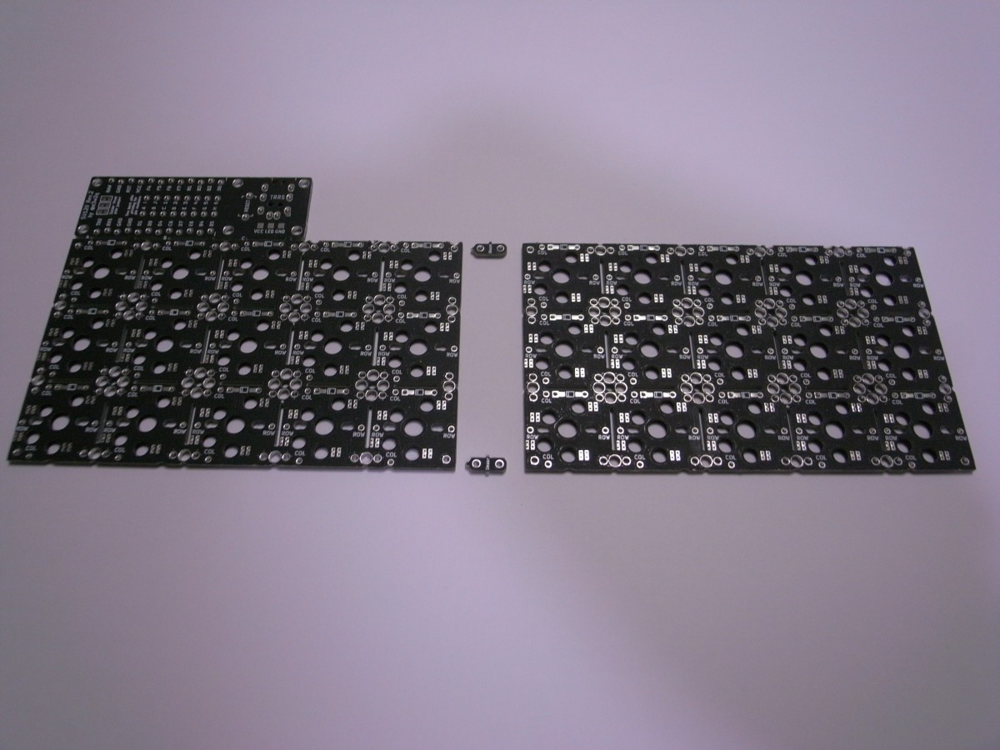
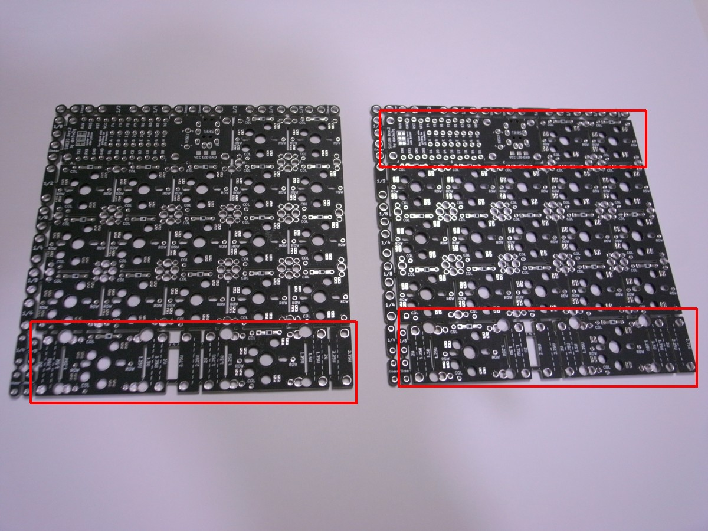
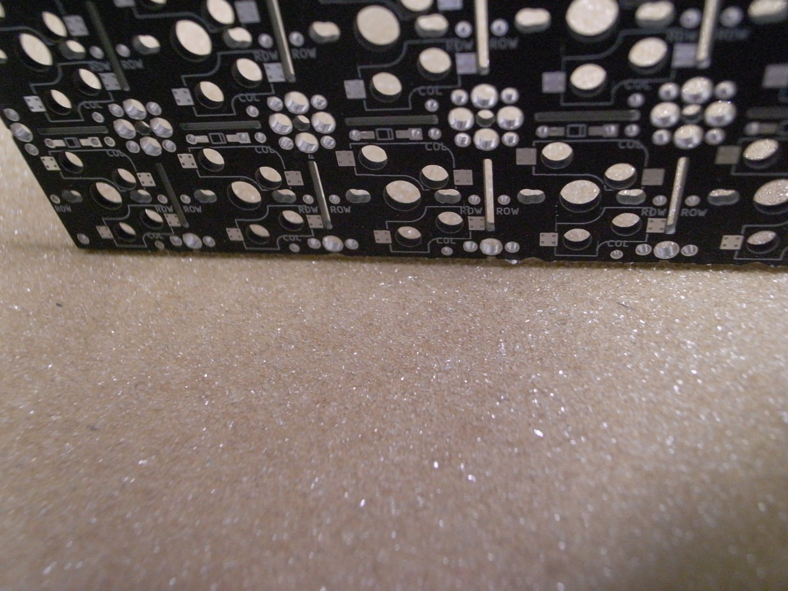
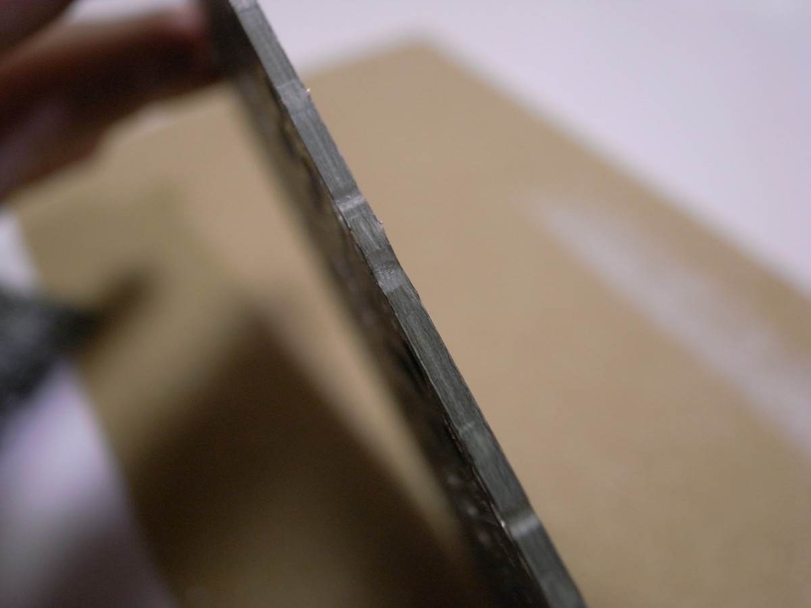
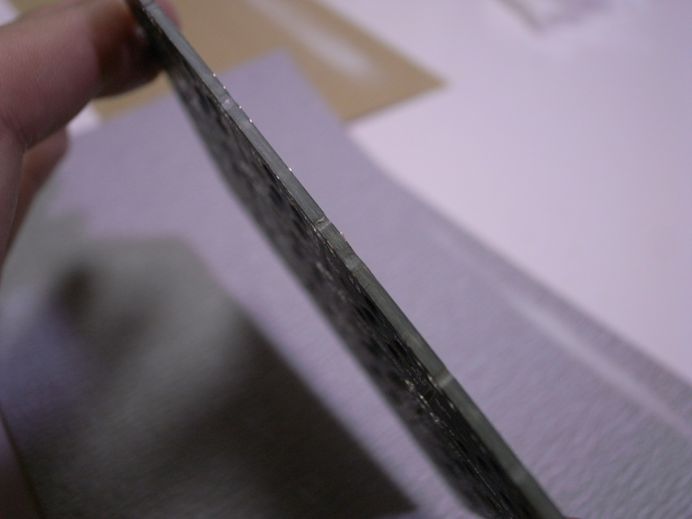
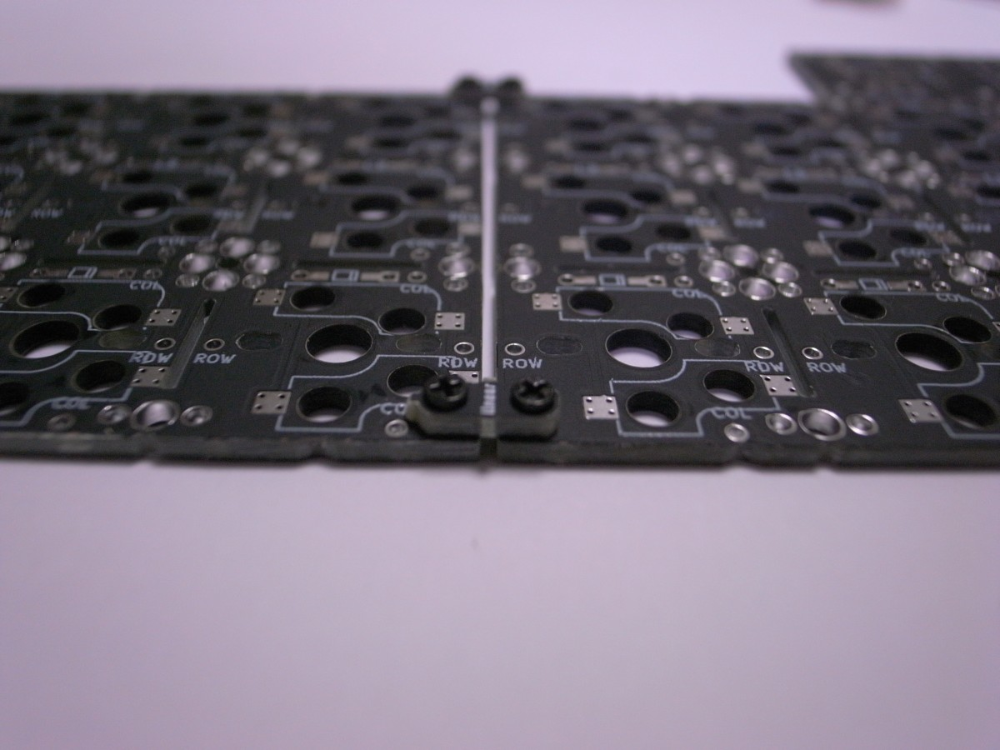
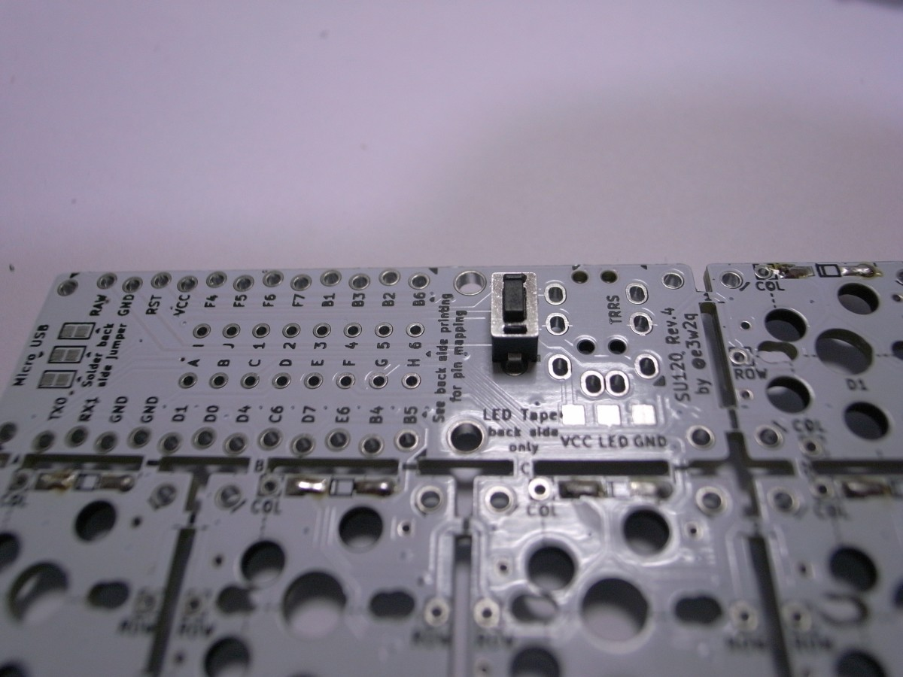
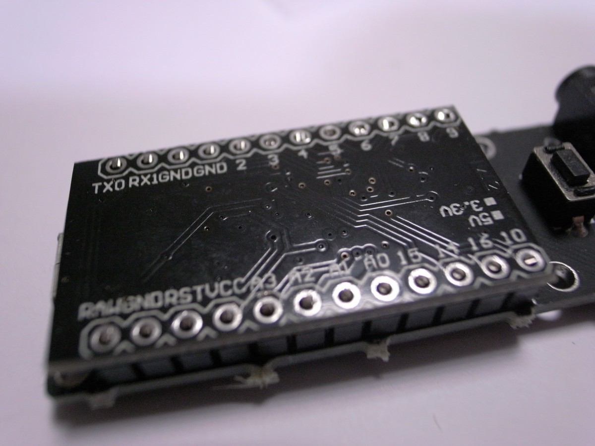
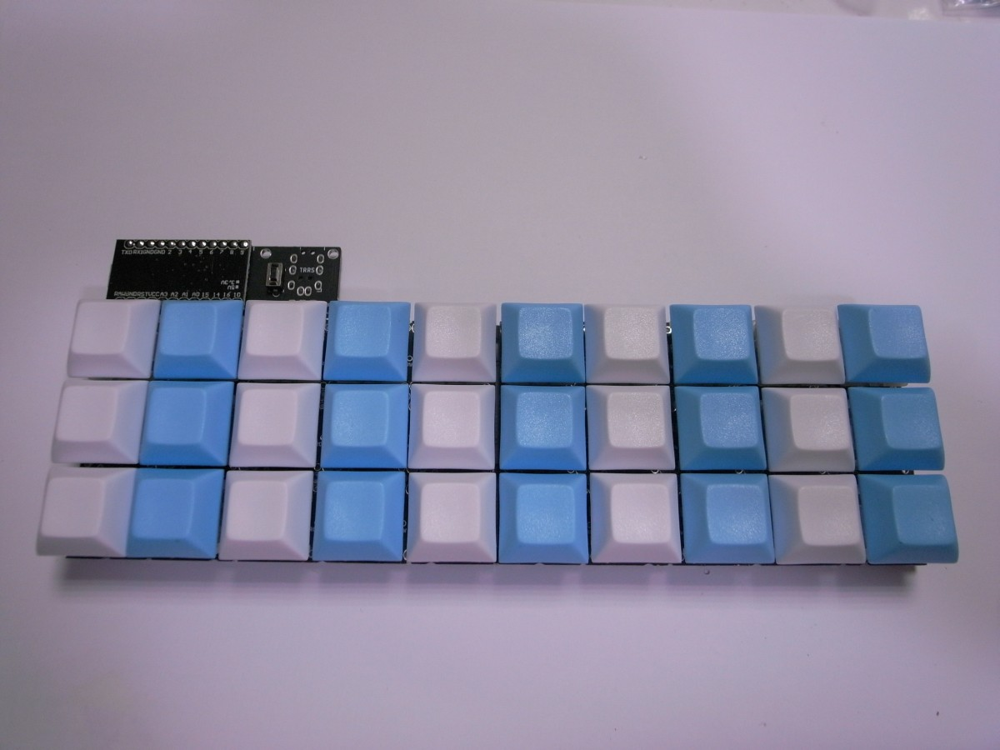
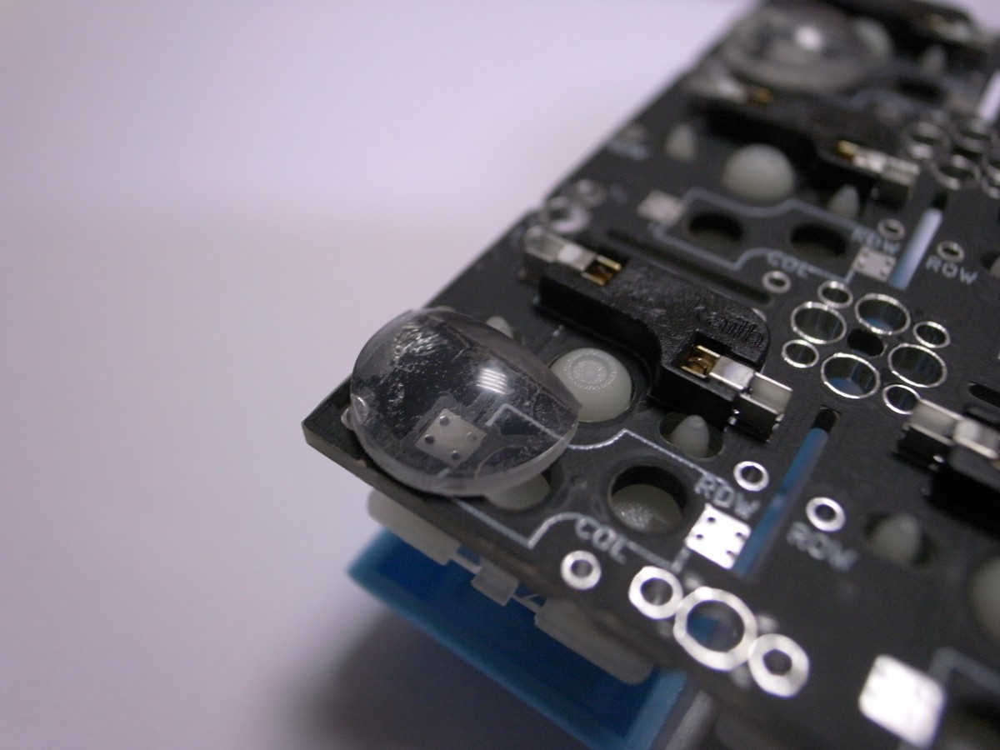

# SU120 3x10 ortholinear keyboard


## 必要なパーツ
| 名前 | 数 | 備考 | 調達先の例 | 参考価格（送料込） |
|:-|:-|:-|--|--|
| SU120 PCB | 2枚 | [入手方法はこちら](../common/pcb_order_guide_jp.md) | [Elecrow Online store](https://www.elecrow.com/) | 10枚で1,400円($12.94) |
| Pro Micro | 1個 | スルーホールをZigzag仕様にしてあるのでコンスルーではなく普通の付属ピンヘッダを使います | [AliExpress](https://www.aliexpress.com/)で「Pro Micro ATmega32U4 5V 16MHz」を検索 | 290円($2.66) |
| タクトスイッチ 2本足のもの | 1個 | | https://www.amazon.co.jp/dp/B00QLTSZK6 | 50個で184円 |
| ダイオード 1N4148 | 30個 | ハンダ付けの難易度は上がりますが表面実装ダイオード(1N4148W)も可 | https://www.amazon.co.jp/dp/B06WWJ76D7 | 500個で313円 |
| LEDテープ お好みの長さ | 1本 | WS2812Bを使用したもの | https://www.aliexpress.com/item/32682015405.html | 1mで500円($4.57) |
| Kailh PCBソケット CherryMX用 または Choc用 | 30個 | | https://yushakobo.jp/shop/a01ps/ | 450円+送料300円 |
| 5ピン仕様のキースイッチ CherryMX用 または Choc用 | 30個 |  | https://yushakobo.jp/product-category/switches/ | 1200円～+送料300円 |
| キーキャップ CherryMX用 または Choc用 | 30個 |  | CherryMX用 https://ja.aliexpress.com/item/32851511530.html | 40個で670円($6.20～) |
| クッションゴム | 6個 |  | ダイソー クッションゴム 14個入り または すべりどめシート | 108円 |
| M1.4ネジ 3.5mm長 | 2本 |  | https://www.aliexpress.com/item/32995302870.html | 100本で110円($0.99) |
| Micro USBケーブル | 1本 | 通信ができるもの | ダイソー | 108円 |
| 計 |  |  |  | 5,933円 |

## 使用する道具、消耗品

[使用する道具、消耗品](../common/tool_guide_jp.md)を参照ください。

## ビルドガイド

### Pro Microのもげ防止加工

Pro Microにエポキシ接着剤を盛って、簡単にはもげないようにします。

参考1:[ProMicroのモゲ防止ついでにQMK_Firmwareを書き込む - Qiita](https://qiita.com/hdbx/items/2f3e4ddfcadda2a5578e)
参考2:[もげ予防 - Self-Made Keyboards in Japan](https://scrapbox.io/self-made-kbds-ja/%E3%82%82%E3%81%92%E4%BA%88%E9%98%B2)

エポキシ接着剤の2液を混ぜます。つまようじを用意します。


接着剤を付け始める前にMicro USBコネクタを横から見てください。側面に穴が開いています。この穴に接着剤が入ると端子が入らなくなったり、入りにくくなったりします。


この穴を避けて、つまようじで接着剤を付けていきます。


乾くまで置いておきます。

### 基板のカット



最終的に上の図のようにカットします。

まず基板端のビスケットをニッパーで切断します。


次に、不要な行を切断します。



行ごと切断するには、ニッパーで表裏に切れ目を入れてから机の端などで折り割ってください。


最後に、L字型に切断します。ハンドソーで青いラインを切ったあと、赤いラインにニッパーで切れ目を入れて折り割ってください。


### 基板側面のヤスリがけ

机に紙ヤスリを置き、その上で基板の側面をヤスリがけします。粗目だけでもそこそこきれいになります。お好みで細目までかけてもよいです。








### 基板の結合

M1.4ネジとビスケットで基板を結合させます。ネジ頭とビスケットが干渉しないように、基板の裏からネジ止めします。



基板の表面のネジ先をハンダ付けすると多少強度が上がります。


続けて基板間の回路を接続します。次に使うダイオードの足を切って、コの字に折り曲げます。


基板間のROWと書かれたスルーホールをコの字に曲げた針金で繋ぎます。


ハンダ付けして飛び出た部分を切ります。または飛び出た部分を切ってからハンダ付けします。


### ダイオードの取り付け

各キースイッチの端の30箇所にダイオードを取り付けます。

キースイッチの枠が描いてあるほうが基板の表で、Kailh PCBソケットの枠が描いてあるほうが裏です。

ダイオードは、基板の表と裏、どちら側に付けても構いません。ただし、ロープロファイルスイッチで将来的にトッププレートを付けたい場合は、以下のいずれかを選択してください。

- 基板の裏側にダイオードを付け、表側に出た足をカットしてからハンダ付けする
- 基板の裏側に表面実装ダイオードをハンダ付けする

ダイオードの足は、指で根本付近を曲げます。はじめに1つだけダイオードを曲げて穴に差し込んでみて、うまくいく曲げ具合を確認して残りのダイオードを同じように曲げてください。


ダイオードの黒くなっている側が、基板の図の二重線の側になるように差し込みます。


全てのダイオードを配置した後、マスキングテープで浮かないようにカバーしておきます。


基板をひっくり返してダイオードを全てハンダ付けし、ニッパーで足を切ります。ダイオードの足を切ってからハンダ付けしても構いません。私はハンダ付けのときに周りの足が邪魔なのと、後がきれいになるので、最近はカットしてからハンダ付けするようにしています。


### PCBソケットの取り付け

基板の裏の印刷された枠に合うようにPCBソケットを配置します。
CherryMX用のPCBソケットを置く場合は、間違った向きに置かないように注意してください。間違った向きに取り付けるとあとでキースイッチが入りません。


PCBソケット両端の金属部分をハンダ付けします。


### リセットスイッチの取り付け

基板の表側からタクトスイッチをはめ込みます。



裏返してハンダ付けします。

### Pro Microの取り付け

基板の表側のPro Micro設置部分の2箇所に、Pro Microに付属している12ピンのピンヘッダの短い側を根本まで差し込みます。


スルーホールがジグザグになっているので、少し入れにくくなっています。ゆっくり押し込んでください。

ピンヘッダにPro Microを差し込みます。Pro Microの裏面（平らなほう）が上になるように、またマイクロUSBが基板端になるようにします。

**向きを間違えるとリカバリーが大変になることがあります。表裏、左右をよく確認してください。**

ニッパーでピンヘッダの足を切ってからPro Microとピンヘッダをハンダ付けします。まず四隅をハンダ付けし、横から見てピンヘッダとの間に隙間があれば押さえながらハンダを温めて浮かないようにします。そのあと、順番に全てハンダ付けします。



基板とピンヘッダはジグザグのスルーホールで接触しているため、ハンダ付けは不要です。

### キースイッチの取り付け

表側から差し込みます。キースイッチの足が曲がっている場合はまっすぐにしてから差し込んでください。


### キーキャップの取り付け

キースイッチにキーキャップをはめます。



### ゴム足の取り付け

ゴム足を裏面に取り付けます。ソケットやキースイッチに接触する場合はハサミで切ってから取り付けます。



試打してみて、基板のたわみが気になればゴム足を増やしてください。

### ファームウェアの書き込み

自作キーボードではファームウェアとしてよくQMK Firmwareが使われますが、ファームウェアの書き込みには、いくつか方法があります。

- [QMK Firmware](https://github.com/qmk/qmk_firmware)本家に取り込まれている
  - GUIの[QMK Toolbox](https://github.com/qmk/qmk_toolbox)を使う
  - CUIでQMK Firmwareをビルドして使う
- [QMK Firmware](https://github.com/qmk/qmk_firmware)本家に取り込まれていない
  - 各作者がフォークしたQMK FirmwareをCUIでビルドして使う

SU120は[QMK Firmware](https://github.com/qmk/qmk_firmware)本家に取り込まれていないので、最後の方法を使います。

まず、以下のリンク先を参考にして、QMK Firmwareのビルド環境を用意します。
- [プログラマーではない人向けのQMK Firmware入門 - Qiita](https://qiita.com/cactusman/items/ac41993d1682c6d8a12e)
- [Getting Started - QMK Firmware](https://docs.qmk.fm/#/newbs_getting_started)

ビルド環境構築時に持ってくるQMK Firmwareは、フォークした[https://github.com/e3w2q/qmk_firmware/tree/su120](https://github.com/e3w2q/qmk_firmware/tree/su120)とします。または、本家を持ってきて、そこに[https://github.com/e3w2q/qmk_firmware/tree/su120/keyboards/handwired/su120](https://github.com/e3w2q/qmk_firmware/tree/su120/keyboards/handwired/su120)以下をコピーしてもよいです。

作者が用意したキーマップを書き込むにはqmk_firmwareのフォルダに移動し、以下を実行します。

```
make handwired/su120/rev1:sasami30:avrdude  
```

**Detecting USB port, reset your controller now...** と表示されたらPro Micro横にハンダ付けしたリセットスイッチを押すと書き込みが始まります。

https://www.keyboardtester.com/tester.html 等でキー入力が行えるかテストしてください。